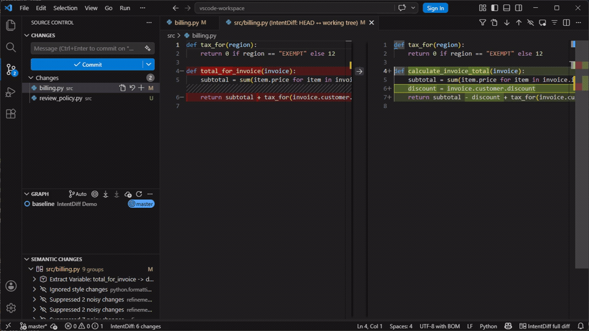
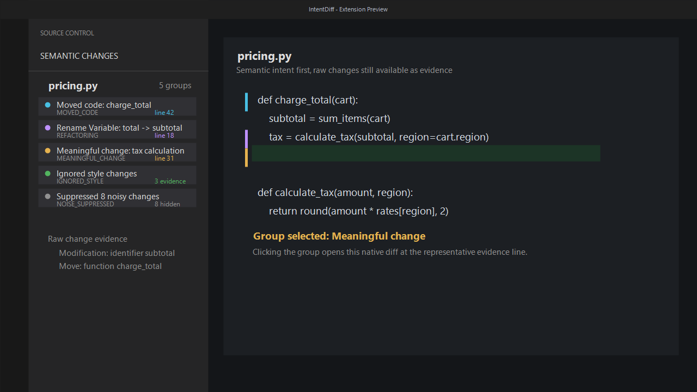
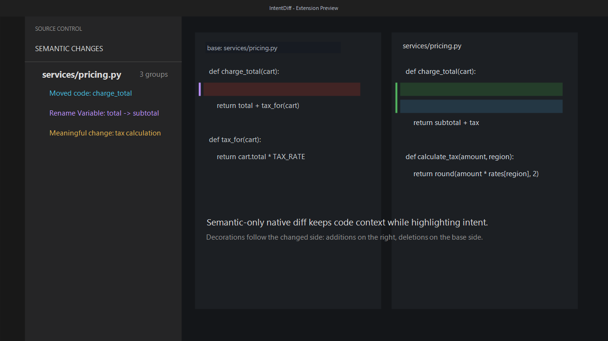
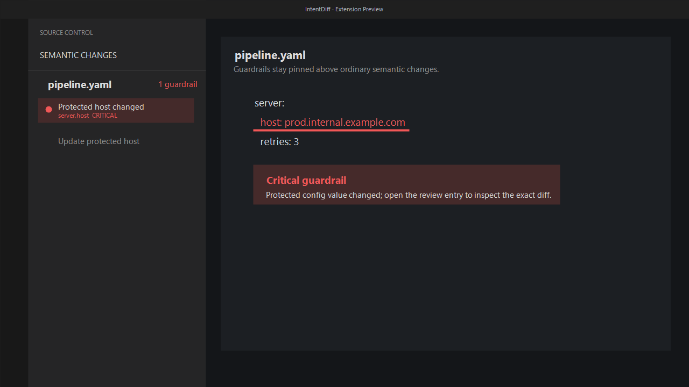

# IntentumDiff VS Code Extension

[](https://github.com/buchochelliq-labs/intentumdiff-vscode/actions/workflows/ci.yml)
[](LICENSE)

Bring IntentumDiff into VS Code with live semantic diff feedback, a
group-first **Semantic Changes** review tree, native diff navigation,
guardrail diagnostics, and cross-file refactoring visibility.





## Highlights

- Review moved code, refactorings, meaningful edits, ignored style, and
  suppressed noise as semantic intent groups.
- Open any file, group, or raw evidence entry in VS Code's native diff editor
  with semantic decorations on the relevant side.
- Keep protected configuration changes visible with pinned guardrail review
  entries and editor diagnostics.
- See which JSON/YAML/config schema or profile was used, or when a detected
  schema provider is unavailable and would improve review quality.
- Install from the VS Marketplace or Open VSX after publication, or dogfood
  locally from a packaged VSIX before the listing is live.





## 🔒 Privacy — your code stays yours

**IntentumDiff is local-first by design. In its default configuration, nothing
about your code — not the files, not the diffs, not the semantic analysis —
leaves your machine.** The diff engine, semantic review, and the built-in
intent explanations all run locally. We do not bundle an API key, do not run a
proxy, and collect no analytics on your code, diffs, or usage.

The **optional** AI intent explainer is **off by default**. Even when you turn it
on, IntentumDiff sends the model a **locally-derived semantic summary — not your
source code**:

| `intentumdiff.intent.llm.codeSharing` | Sent to the model | Bodies / literals |
|---|---|:---:|
| `signatures` *(default)* | Summary + symbol names + param/return types | ❌ |
| `facts` | Structural facts only (no identifiers) | ❌ |
| `full` | Actual source — **local endpoints only**; cloud/Copilot auto-downgrade to `signatures` | ✅ (local only) |

**Your raw source is only ever transmitted to a local model you run yourself**
(e.g. Ollama / LM Studio / vLLM). Cloud providers and GitHub Copilot never
receive it. Cloud use is Bring-Your-Own-Key; keys live in VS Code SecretStorage,
never in `settings.json`.

👉 **Full policy: [PRIVACY.md](PRIVACY.md).**

## Requirements

- **The IntentumDiff engine.** The extension is a front end for the `intentumdiff`
  command and needs it installed:

  ```bash
  pip install intentumdiff-python
  ```

  That is the whole installation — the Rust engine and all 78 language parsers are
  inside that one package. Requires Python 3.12 or newer.

- VS Code 1.90 or newer
- A workspace folder backed by git

If `intentumdiff` is not on your `PATH` — common when it lives in a virtual environment —
point the extension at it with `intentumdiff.executable`.

Full guide: **https://buchochelliq-labs.github.io/intentumdiff-docs/getting-started/**

## Install

1. Install the engine — `pip install intentumdiff-python` (Python 3.12+)
2. Install **IntentumDiff** from the VS Code Marketplace or Open VSX, extension ID
   `buchochelliq-labs.intentumdiff`

Both steps are needed: the extension is a front end and the engine does the work.

## Documentation

**https://buchochelliq-labs.github.io/intentumdiff-docs/**

- [Getting started](https://buchochelliq-labs.github.io/intentumdiff-docs/getting-started/)
- [What the annotations mean](https://buchochelliq-labs.github.io/intentumdiff-docs/vscode/)
- [Diffing images](https://buchochelliq-labs.github.io/intentumdiff-docs/assets/)
- [Troubleshooting](https://buchochelliq-labs.github.io/intentumdiff-docs/troubleshooting/)

## Settings

The `intentumdiff.*` setting namespace is retained as a compatibility alias for the
first public IntentumDiff release.

| Setting | Default | Purpose |
|---|---|---|
| `intentumdiff.executable` | `intentumdiff` | Command or absolute path for the IntentumDiff executable; `intentumdiff` remains a supported compatibility command |
| `intentumdiff.ref` | `HEAD` | Git ref to compare live buffers against |
| `intentumdiff.enabled` | `true` | Enables live semantic diffing |
| `intentumdiff.debounceMs` | `250` | Debounce before sending a diff request |
| `intentumdiff.fuel` | `null` | Optional `--fuel` override for active-file live diffs. Defaults to IntentumDiff's bounded parser fuel; use `"inf"` only in trusted workspaces. |
| `intentumdiff.trace` | `false` | Writes protocol/server logs to the output channel |
| `intentumdiff.schemas.fetchMode` | `"cache-only"` | Controls runtime JSON/YAML schema fetches: `auto`, `cache-only`, or `off`; workspace values are ignored |
| `intentumdiff.schemas.cacheTtlHours` | `24` | Hours before cached remote schemas are considered stale |
| `intentumdiff.schemas.allowPrivateHosts` | `false` | Allows schema URLs on private/internal hosts; workspace values are ignored |
| `intentumdiff.diff.fallbackDiff` | `true` | Shows fallback token/text diffs when semantic parsing falls back |
| `intentumdiff.diff.hideComments` | `false` | Hides changes whose semantic nodes are comments |
| `intentumdiff.visualization.showAdditions` | `true` | Shows addition decorations |
| `intentumdiff.visualization.showDeletions` | `true` | Shows deletion decorations and inline deletion markers |
| `intentumdiff.visualization.showModifications` | `true` | Shows modification decorations |
| `intentumdiff.visualization.inlineDeletionMarkers` | `true` | Shows subtle modified-editor markers for inline deletions |
| `intentumdiff.visualization.movedCode` | `true` | Shows move/refactoring decorations |
| `intentumdiff.intent.explainer` | `"deterministic"` | Intent "why" source: `deterministic` (offline, local) or `llm` (opt-in AI enrichment) |
| `intentumdiff.intent.llm.provider` | `"vscode-lm"` | LLM backend when the explainer is on: `vscode-lm` (your Copilot, no key), `anthropic` (BYOK), or `openai-compatible` (BYOK or local) |
| `intentumdiff.intent.llm.codeSharing` | `"signatures"` | Privacy level of the LLM payload: `signatures` (names/types, no bodies), `facts` (most private, no identifiers), or `full` (source — **local endpoints only**; cloud auto-downgrades) |
| `intentumdiff.intent.llm.baseUrl` | `""` | Base URL for the anthropic / openai-compatible provider (e.g. `http://localhost:11434` for Ollama). Blank = provider default |
| `intentumdiff.intent.llm.model` | `""` | Model id (BYOK) or family filter (vscode-lm). Blank = a sensible default |

See **[PRIVACY.md](PRIVACY.md)** for exactly what the intent explainer sends at
each `codeSharing` level and the local-only guarantee for `full`.

## Commands

- `IntentumDiff: Toggle Live Semantic Diff`
- `IntentumDiff: Toggle Semantic Diff Overlay`
- `IntentumDiff: Configure Visible Change Types`
- `IntentumDiff: Show Comment Changes` / `IntentumDiff: Hide Comment Changes`
- `IntentumDiff: Restart LiveServer`
- `IntentumDiff: Diff Active File`
- `IntentumDiff: Refresh Semantic Review`
- `IntentumDiff: Open Semantic Diff`
- `IntentumDiff: Clear Semantic Review`
- `IntentumDiff: Reveal Active File in Semantic Review`
- `IntentumDiff: Show Output`
- `IntentumDiff: Set Intent Explainer Key (BYOK)` — stores a cloud LLM key in VS Code SecretStorage
- `IntentumDiff: Clear Intent Explainer Key`

## Semantic Changes Side Panel

Open the Source Control sidebar and expand **Semantic Changes**. The view
auto-refreshes saved working-tree semantic changes against `intentumdiff.ref` when it
becomes visible, then keeps itself current from file saves, creates, deletes,
renames, Git status changes, and a fallback poll. Use the refresh button when
you want to rerun the review immediately.

The panel lists changed files directly for a single workspace. In multi-root
workspaces, results are grouped by workspace and file:

- protected guardrail violations are pinned first
- cross-file refactorings such as moved symbols, cross-file renames, and file
  splits appear next
- semantic intent groups for moved code, refactorings, meaningful changes,
  ignored style, and suppressed noise follow
- raw changes remain visible as supporting evidence under the same file
- style-only, clean, skipped, and error entries are kept visible

Selecting a file or entry opens a native VS Code diff editor against
`intentumdiff.ref`. The left side is a read-only `intentumdiff-base:` document fetched from git;
the right side is the working-tree file. If the entry has a semantic position,
the relevant diff side reveals it and reuses the existing diagnostics/decorations
mapping. Deleted text is selected on the base side because it no longer exists
in the working-tree file; when the file itself was deleted, the right side is an
empty read-only review document.

Cross-file rows also reveal the moved or renamed target symbol when the
commit-level index includes position metadata. When a parser cannot provide
that evidence, the extension falls back to opening the target file diff.

Semantic overlays are side-aware:

- additions, modifications, refactorings, and moves decorate the modified side
- deletions decorate the base side when an old position is available
- inline deletion markers on the modified side can only indicate the gap where
  removed text used to be
- guardrail diagnostics stay attached to the working-tree URI so Problems entries
  remain actionable

The side-panel review is snapshot-based: it reads saved git/working-tree
content through LiveServer review and incremental diff operations. Unsaved
buffers are still covered by active-file live feedback, but are intentionally
excluded from cross-file review V1. A custom webview renderer, inline semantic
comments, and hosted PR review remain future slices.

