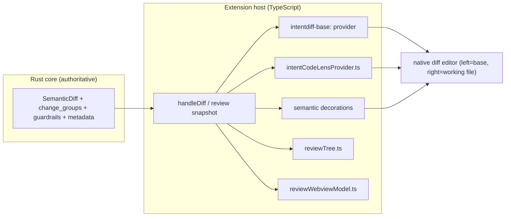

# IntentDiff Diff Viewer — Architecture (native-first)

> Source-of-truth architecture for how the IntentDiff VS Code extension shows a diff and
> its **intent**. This document supersedes the earlier Monaco / `App.tsx` contract: the
> custom Monaco webview was **retired** in the UX overhaul. The primary surface is now
> VS Code's **native diff editor**, decorated with semantic intent; a single webview
> remains for the intent/review summary, staging, and the perceptual asset diff.

## 1. Surfaces at a glance

| Surface | What it is | Primary use |
|---|---|---|
| **Native diff editor** | VS Code's built-in `vscode.diff` (left = read-only base, right = the real working file) | The live, editable diff. Edit the right side and intent recomputes as you type. |
| **Intent CodeLens + Peek** | `CodeLensProvider` + a Peek command over the working doc | `CATEGORY · <why>` above each changed hunk; Peek shows the full explanation + evidence. |
| **Semantic decorations** | Editor decorations bound to `intentdiff.semanticChanges.*` theme colors | Gutter strips, inline tints, overview-ruler ticks per change category. |
| **Semantic Changes tree** | `TreeDataProvider` in the IntentDiff view container | Navigate files → intents → raw evidence, ordered by importance. |
| **Review panel** | One webview (`reviewWebviewModel.ts`) | Intent summary, Evidence, Diagnostics, Release Notes, an editable semantic-diff tab with per-hunk staging, and the perceptual asset diff for images. |

There is **no Monaco**, no `createDiffEditor`/`createDiffEditor` webview embed, no gap state
machine, and no floating chevron overlay. Those were removed; do not reintroduce them.

## 2. The native diff editor

Opening a diff (`intentdiff.openSemanticDiff` → `openFullNativeDiff`) runs:

```
vscode.diff(baseUri, modifiedUri, title, { preview: false })
```

- **`baseUri`** uses the `intentdiff-base:` content provider (`baseContentProvider.ts`).
  Its content is `git show <ref>:<relativePath>` at the review's resolved commit; the URI
  query encodes `{ folderUri, ref, relativePath, cacheNonce }` (`baseUri.ts`). It is
  read-only and cached by `folderUri::ref::relativePath::cacheNonce`.
- **`modifiedUri`** is the **real working-tree file** (`existingOrEmptyModifiedUri`), so the
  right pane is the actual editable buffer — edits, save, and the live overlay all work.
  Added files diff against an empty `intentdiff-empty:` document.

### Live collapse + editable + re-diff (the three original goals, natively)

1. **Collapse/expand unchanged regions** — `diffEditor.hideUnchangedRegions.*` is enabled in
   `package.json` `configurationDefaults`; VS Code renders the native "⋯ N hidden lines /
   expand" affordances. No custom hidden-area machinery.
2. **Editable** — the right pane is the working file URI (see above).
3. **Live intent** — editing the working buffer fires
   `scheduleDocument → diffDocument → handleDiff` (debounced by `intentdiff.debounceMs`),
   which re-runs the engine and refreshes the intent CodeLens + semantic decorations.

### Semantic-only projection (optional)

`intentdiff.review.diffSurface` and the "Semantic-only" action open a projected diff via
`semanticOnlyContentProvider.ts` (`intentdiff-semantic-base:` / `intentdiff-semantic-modified:`)
that hides non-semantic context. This is a read-only projection layered on the same engine
output; the full native diff remains the editable surface.

## 3. Dataflow



The engine is authoritative (see `RUST_PYTHON_ENGINE_ARCHITECTURE.md`); the extension only
consumes `SemanticDiff` (`src/types.ts`) and renders it across the surfaces above.

## 4. Intent CodeLens + Peek

- `intentCodeLens.ts` (pure, unit-tested) derives the lens title and the Peek content from a
  `SemanticChange` / `ChangeGroup` via `intentExplain.ts` (`what` + `why` + derived risk).
- `intentCodeLensProvider.ts` (vscode-facing) registers the provider over the working doc and
  the `intentdiff-base:` side, caches per-file contexts (`liveIntentContexts`) so lenses show
  while editing, and implements the `intentdiff.peekIntent` command.
- Risk is **derived** (not a discrete engine field): `MEANINGFUL_CHANGE → Behavior`;
  `REFACTORING`/`MOVED_CODE → Internal`; `IGNORED_STYLE`/`NOISE_SUPPRESSED → excluded`;
  guardrail violations → critical.
- Optional LLM enrichment (`intentLlmExplainer.ts`) is BYOK/`vscode-lm`, async, and sends a
  privacy-safe fact sheet (or code only to a local endpoint) — never blocks the UI.

## 5. The review panel (the one justified webview)

`reviewWebviewModel.ts` builds the panel HTML (theme-native, 100% `--vscode-*` variables):

- **Intent summary / Release Notes / Evidence / Diagnostics** views.
- An **editable semantic-diff tab** with per-hunk **Stage/Revert** (git index patches) and
  inline editing, syntax-highlighted via the vendored highlighter in `media/highlight/`.
- The **perceptual asset diff** for images (`renderAssetDiffWorkbench` / `assetModeViewer`):
  side-by-side / onion / swipe / difference modes, a marching-ants change lasso over both
  panes, interactive hotspots, blink comparator, and per-channel histograms. All artifacts
  come from the Rust engine (`crates/rust-core-host/src/asset_diff.rs`); **no image
  processing happens in the webview**.

## 6. Key files

| File | Role |
|---|---|
| `src/extension.ts` | Commands, native-diff open flow, decorations, live re-diff, review snapshots. |
| `src/baseUri.ts` / `src/baseContentProvider.ts` | `intentdiff-base:` read-only base document (`git show ref:path`). |
| `src/semanticOnlyContentProvider.ts` / `src/semanticOnlyDiff.ts` | Optional semantic-only projected diff. |
| `src/intentCodeLens.ts` / `src/intentCodeLensProvider.ts` | Intent CodeLens + Peek. |
| `src/intentExplain.ts` / `src/intentLlmExplainer.ts` / `src/intentLlmPrompt.ts` | Deterministic + opt-in LLM explanations. |
| `src/reviewTree.ts` / `src/reviewModel.ts` | Semantic Changes tree + ordering. |
| `src/reviewWebviewModel.ts` / `src/reviewWebview.ts` | The review panel model + controller. |
| `src/types.ts` | The `SemanticDiff` shape the extension consumes. |

## 7. What was retired (and must not come back)

- The custom Monaco webview (`media/reviewDiff.js` / `media/reviewDiff.css`), the
  `monaco-diff-host` embed, and the `media/monaco/` AMD bundle.
- The gap state machine (`gapStates`, `expandGap`/`collapseGap`, `reconstructFullFile`),
  floating chevron overlays, and per-side `setHiddenAreas` machinery.
- The `intentdiff.review.chevronDesign` setting and the "match `App.tsx`/Monaco" contract.

Native collapse (`hideUnchangedRegions`), the real working-tree buffer, and semantic
history and `CLAUDE.md` for the current architectural summary.

## 8. Verification

- Theme fidelity: no chrome hex literals in panel output; category classes bind to
  `intentdiff.semanticChanges.*` — `test/themeColors.test.ts`.
- Panel model + interactions (collapse, staging, asset viewer, script executes) —
  `test/reviewWebviewModel.test.ts` (JSDOM).
- Intent derivation — `test/intentCodeLens.test.ts`, `test/intentExplain.test.ts`,
  `test/intentLlmPrompt.test.ts`, `test/releaseNotes.test.ts`.
- Tree ordering — `test/reviewTree.test.ts`.
- Base document safety — `test/baseUri.test.ts` (rejects traversal/absolute/directory paths).
- `npm run lint` + `npm run test` green.
